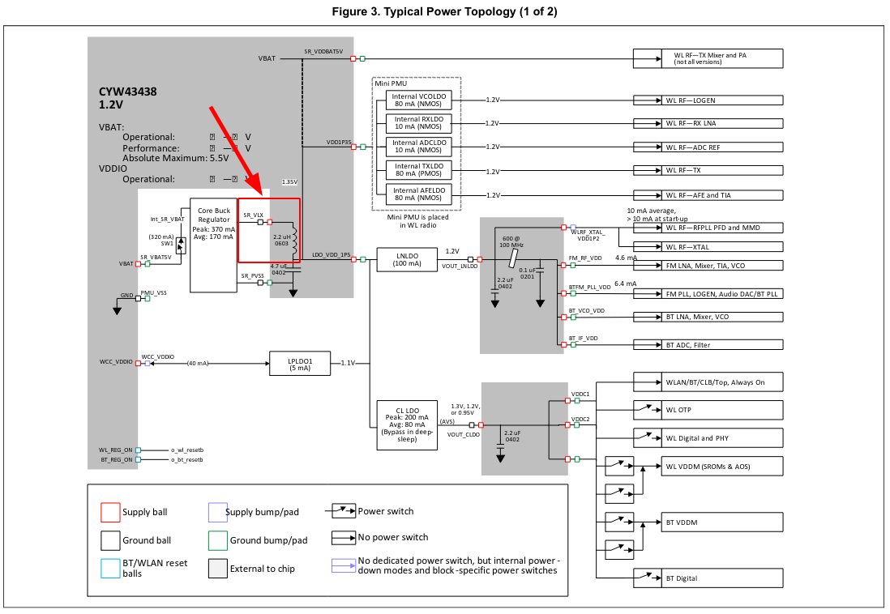
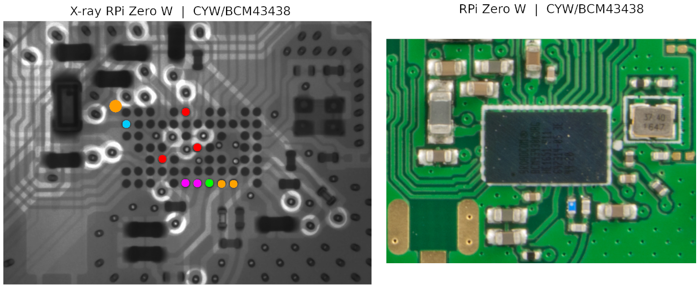
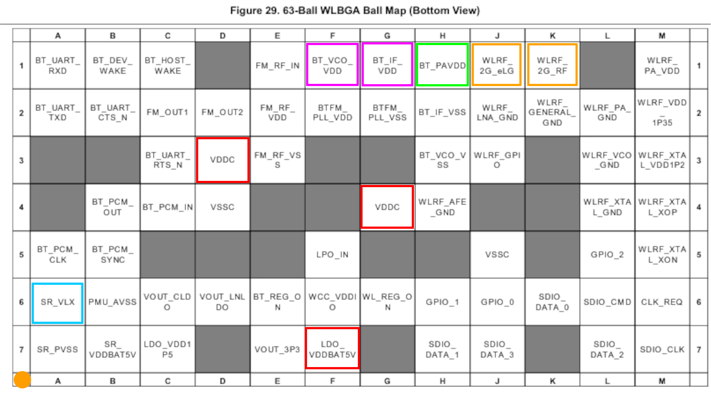
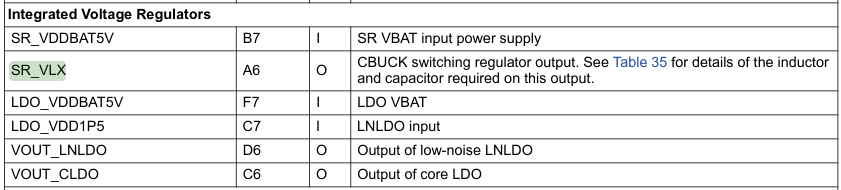
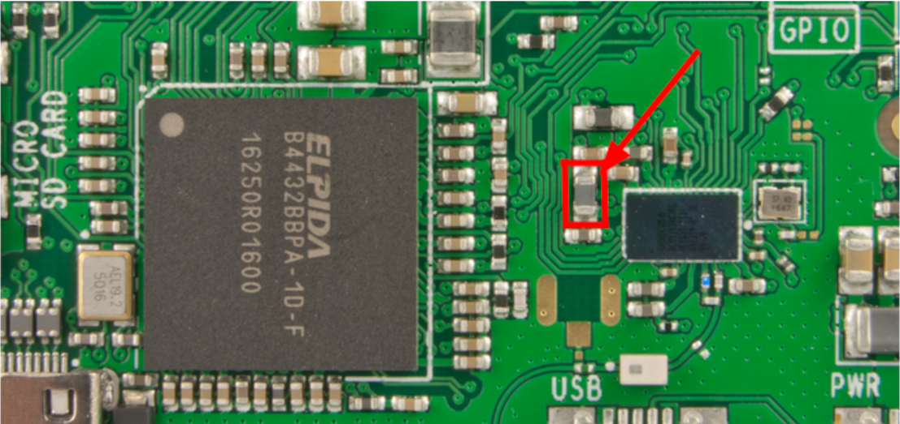
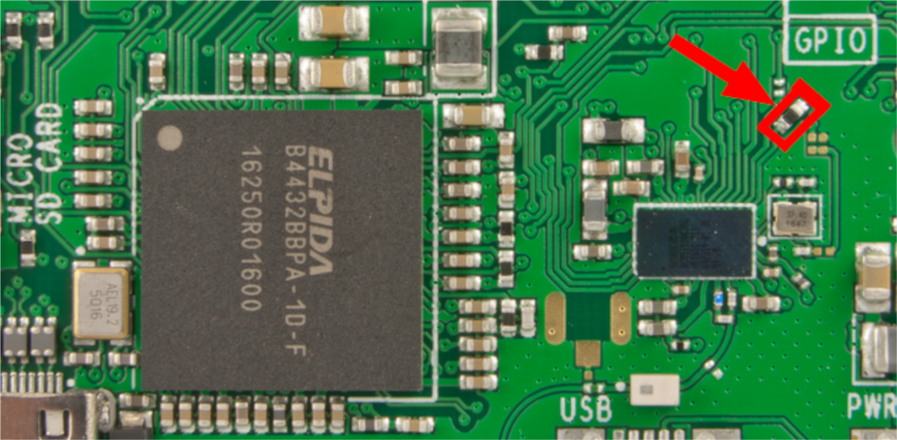
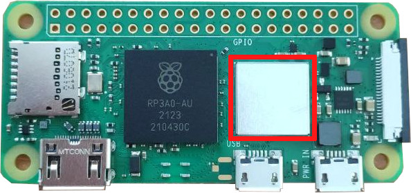
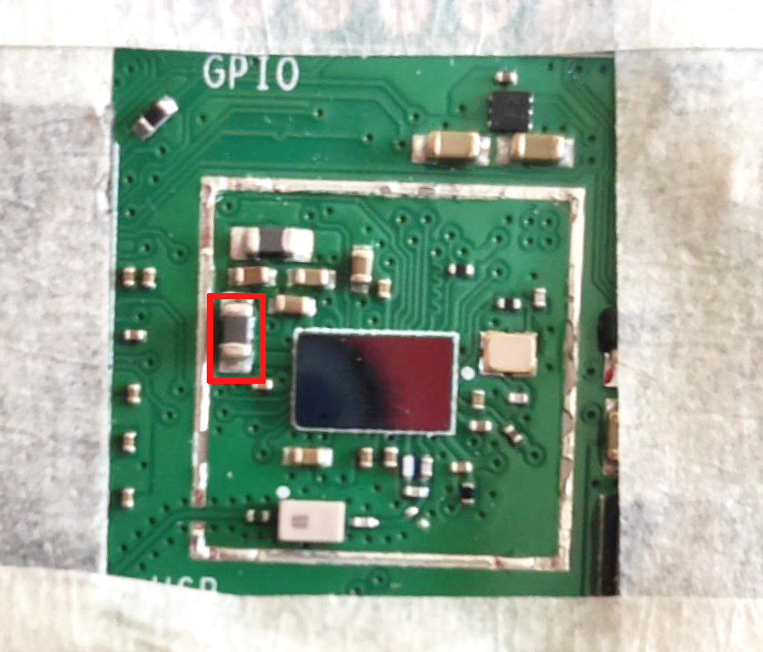
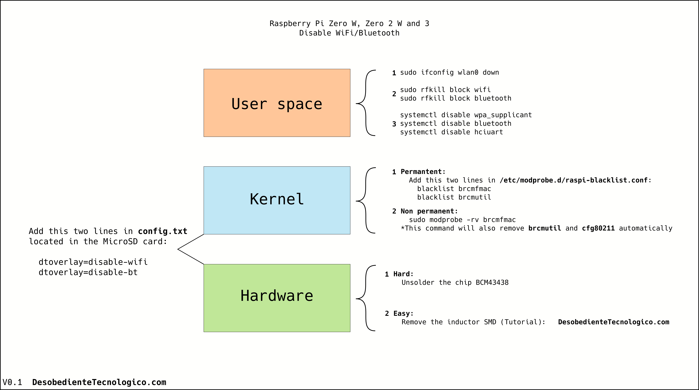

# Disabling WiFI/Bluetooth by hardware [ From Raspberry Pi Zero W to 3B+ ]

### Translations:
 - <a href="https://estudiobitcoin.com/deshabilitar-wifi-y-bluetooth-de-raspberry-pi/">Español</a>

### Index:
 1. Intro.
 1. CYW/BCM43438 schematics.
 1. X-ray images and WLBGA ball map (colored).
 1. Images showing what to remove and extra.
 1. Raspberry Pi Zero 2 W shield information.
 1. Pliers to remove the SMD inductor and video.
 1. Check by terminal if WiFi and Bluetooth are disconnected.
 1. [NEW] Scheme with examples to disable WiFi and Bluetooth from different layers.
 ---
 # Intro:

One of the biggest problems are that Raspberry Pi do not show the schematics of the wireless. 
See this example: https://datasheets.raspberrypi.com/rpizero/raspberry-pi-zero-w-reduced-schematics.pdf

Thanks that we got access to a X-ray picture of the wireless chip, I tried to figure out some of the circuits. Not easy because that PCB is multilayer. So I just figured out some of them.

The best news are that RPi Zero w and RPi Zero 2 W wireless chip still in the same position, is not rotated and in both boards we should remove exactly the same SMD component. Cool!, isn't it? 🙂

I didn't end up removing <a href="https://en.wikipedia.org/wiki/IC_power-supply_pin">VDD</a> becasuse I can't see well the all layers and to me seems like <a href="https://en.wikipedia.org/wiki/IC_power-supply_pin">VDD</a> comes from another PCB layer under the chip.

---
# CYW/BCM43438 schematics:

#### Basic schematics showing were we are going to get rid of the SMD inductor.

Documentation source: (https://www.cypress.com/file/298076/download)

---
# X-ray images and WLBGA ball map (colored):

### 🟠 Orange big dot made as position reference.

#### Here we have the X-ray image and normal one to let you know the actual position. 

X-ray image by **@Vilas1979**

---
# Images showing what to remove and extra:

### Image showing what to remove to disable WiFi/Bluetooth by removing the inductor that goes to the pin **SR_VLX**:
Information about **SR_VLX**:

VDD and GND still connected into the board but chip is not able to work without the inductor. But don't worry:

💡 **As a simile**: Having a car with 1 of 3 <a href="https://en.wikipedia.org/wiki/Anti-lock_braking_system">ABS/brakes</a> cable broken. The engine will start, but the ECU will detect that the <a href="https://en.wikipedia.org/wiki/Anti-lock_braking_system">ABS</a> is not reachable. So is impossible to get connected to it, transmit any data and use that component.

### EXTRA: If you got the case that you would like just to remove the WiFi, just remove this component:

### Raspberry Pi Zero 2 W metal shield information:
This is the metal shield that contains the wireless chip. You should remove it, in order to access to the SMD components:

#### You can use:

To remove the whole shield:
1. Heat gun
1. Hair dryer

To break a part of the shield:
1. Dremel
1. Sand paper

Once you have removed it you will see this (marked in red, the component to be removed):

## Remove SMD inductor

### Easy: with pliers:

### Video showing how to remove it with pliers:

### 📺 Video of the process:
- [Video by @SeedSigner](https://video.twimg.com/amplify_video/1616914307140165635/vid/750x640/sTZKr1mknSnGfy0g.mp4?tag=16)

### Text tutorial just using desoldering iron:

- Get soldering iron quite warm. Put the soldering iron on top of each extremes (first one, and then the other) of the SMD and push a bit to one side.

---

# Check by terminal if WiFi and Bluetooth are disconnected.

#### WiFi
Once you boot the system, open Terminal and type:
 - `ip addr`

If there is not **wlan0**, WiFi is disabled by hardware.

#### Bluetooth
Open Terminal and type:
 - `bluetoothctl`

If bluetoothctl do not open or seems to be frozen, is good signal... But if open type:
 - `scan on`

If you can see values (Probably not), write me back.

Enjoy!

---

# NEW scheme with examples to disable WiFi and Bluetooth from different layers.

As a note: If a new kernel is compiled without the WiFi or Bluetooth modules, as well as disabling certain components, it is not necessary to use any of the commands shown above.

---

If you like it you can support me: <a href="http://btcpay.desobedientetecnologico.com/">On-Chain ⛓️ or ⚡️ Lightning network </a>

###### License: **CC BY 4.0**
